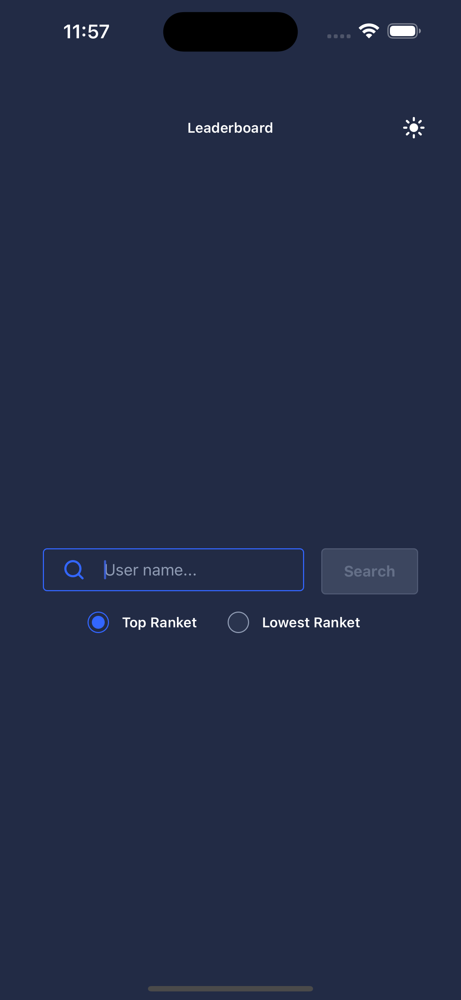
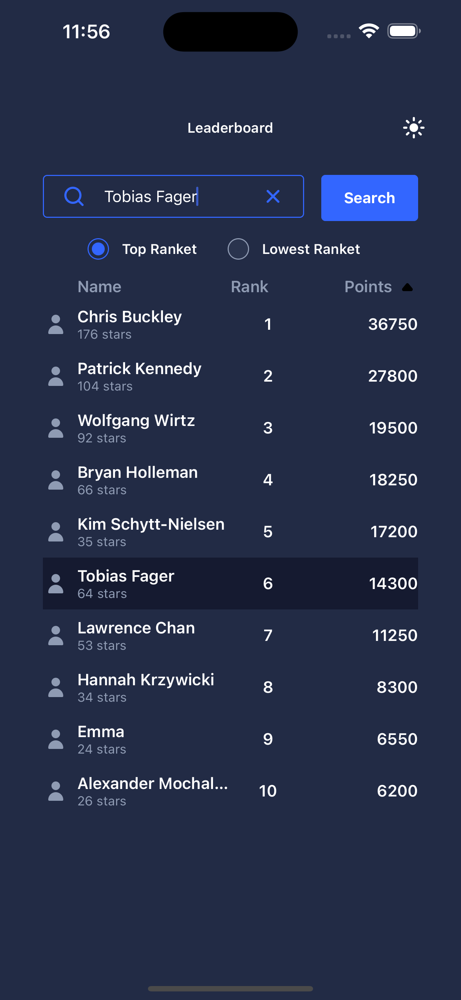
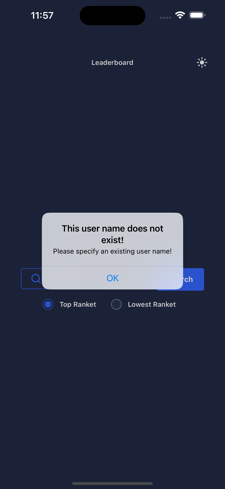

# LeaderBoard Application

## Overview

LeaderBoard is a React Native application designed to display a leaderboard based on a provided dataset of user data. It allows users to input a username, search for it, and view the top 10 users with the most bananas. The searched user, if found, is highlighted in the list. Additionally, users can sort the list by name and view the lowest ranked users.

## Features

- Input a username and search for it.
- Display the top 10 users with the most bananas.
- Highlight the searched user in the list if found.
- Sort the list by name.
- View the lowest ranked users.
- Utilizes Redux for state management.
- Styled with Ui-kitten for enhanced aesthetics.
- Offers a dark theme for better visibility.

## Usage

1. Clone the repository: `git clone https://github.com/klestovVlad/Leaderboard.git`
2. Navigate to the project directory: `cd LeaderBoard`
3. Install dependencies: `npm install` or `yarn install`
4. Run the application: `npm start` or `yarn start`
5. Follow the instructions to run the application on your desired platform (iOS/Android).

## Functionalities

- **Search Functionality**: Input a username and click the search button to render a list of the top 10 users with the most bananas. If the searched user exists, it will be highlighted in the list.
- **Sorting Options**: Sort the list by name to view users alphabetically. Additionally, view the lowest ranked users, with users of the same score listed alphabetically.
- **Error Handling**: If the searched user does not exist, an error message is displayed: "This user name does not exist! Please specify an existing user name!".
- **Fuzzy Search**: Fuzzy search to allow users to search by partial name.

## Dependencies

- React Native
- Redux
- Ui-kitten

## Screenshots

